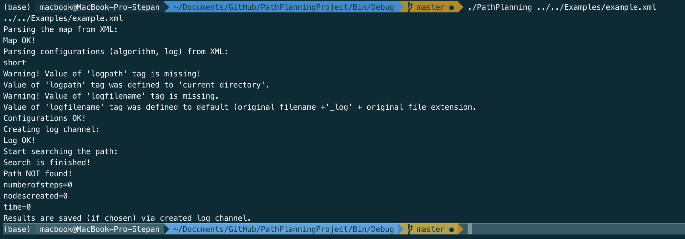

# Multiagent planning
Исходный код проекта по многоагентному планированию траекторий.


### Описание программы

Программа решает задачу планирования траекторий движения нескольких объектов (например, роботов) на плоскости, подчиняющейся следующим условиям:
- во-первых, плоскость должна представлять из себя прямоугольник со сторонами, параллельными осям координат
- во-вторых, она должна быть разлинована в виде сетки из маленьких прямоугольников
- в-третьих, каждый маленький прямоугольник (клетка) должен быть отнесён ровно к одному из двух типов: свободная клетка или занятая

Задача: построить оптимальный набор путей из начальной клетки в конечную для каждого агента или выдать результат, что некоторых путей не существует. Конкретные опции пути можно задать в файле, который подаётся на вход программе.

### Входные данные

На вход в качестве аргумента командной строки подаётся XML-файл, имеющий следующую структуру:

`<root>`<br>
&nbsp;&nbsp;&nbsp;&nbsp; `<map>` — параметры карты<br>
&nbsp;&nbsp;&nbsp;&nbsp;&nbsp;&nbsp;&nbsp;&nbsp; `<width>` — ширина карты (количество клеток по оси X)<br>
&nbsp;&nbsp;&nbsp;&nbsp;&nbsp;&nbsp;&nbsp;&nbsp; `<height>` — высота карты (количество клеток по оси Y)<br>
&nbsp;&nbsp;&nbsp;&nbsp;&nbsp;&nbsp;&nbsp;&nbsp; `<cellsize>` — размер клеток карты<br>
&nbsp;&nbsp;&nbsp;&nbsp;&nbsp;&nbsp;&nbsp;&nbsp; `<agents>` — количество агентов<br>
&nbsp;&nbsp;&nbsp;&nbsp;&nbsp;&nbsp;&nbsp;&nbsp; `<startx>` — координаты начальных точек по X<br>
&nbsp;&nbsp;&nbsp;&nbsp;&nbsp;&nbsp;&nbsp;&nbsp; `<starty>` — координаты начальных точек по Y<br>
&nbsp;&nbsp;&nbsp;&nbsp;&nbsp;&nbsp;&nbsp;&nbsp; `<finishx>` — координаты конечных точек по X<br>
&nbsp;&nbsp;&nbsp;&nbsp;&nbsp;&nbsp;&nbsp;&nbsp; `<finishy>` — координаты конечных точек по Y<br>
&nbsp;&nbsp;&nbsp;&nbsp;&nbsp;&nbsp;&nbsp;&nbsp; `<grid>` — сама карта<br>
&nbsp;&nbsp;&nbsp;&nbsp;&nbsp;&nbsp;&nbsp;&nbsp;&nbsp;&nbsp;&nbsp;&nbsp; `<row>` — строка карты<br>
&nbsp;&nbsp;&nbsp;&nbsp; `<algorithm>` — параметры алгоритма<br>
&nbsp;&nbsp;&nbsp;&nbsp;&nbsp;&nbsp;&nbsp;&nbsp; `<metrictype>` — метрика, используемая в эвристической функции (`euclidean`, `manhattan`, `chebyshev`, `diagonal`)<br>
&nbsp;&nbsp;&nbsp;&nbsp;&nbsp;&nbsp;&nbsp;&nbsp; `<searchtype>` — алгоритм поиска (`dijkstra` или `astar`)<br>
&nbsp;&nbsp;&nbsp;&nbsp;&nbsp;&nbsp;&nbsp;&nbsp; `<hweight>` — вес эвристики<br>
&nbsp;&nbsp;&nbsp;&nbsp;&nbsp;&nbsp;&nbsp;&nbsp; `<priority>` — способ присвоения приоритетов агентам<br>
&nbsp;&nbsp;&nbsp;&nbsp; `<options>` — параметры отображения результата

### Выходные данные

Результат работы представляется в виде XML-файла, в котором, помимо входных данных, есть следующая информация:

&nbsp;&nbsp;&nbsp;&nbsp; `<log>`<br>
&nbsp;&nbsp;&nbsp;&nbsp;&nbsp;&nbsp;&nbsp;&nbsp; `<agent>` — информация о найденном пути для конкретного агента<br>
&nbsp;&nbsp;&nbsp;&nbsp;&nbsp;&nbsp;&nbsp;&nbsp;&nbsp;&nbsp;&nbsp;&nbsp; `<mapfilename>` — путь к файлу со входными данными<br>
&nbsp;&nbsp;&nbsp;&nbsp;&nbsp;&nbsp;&nbsp;&nbsp;&nbsp;&nbsp;&nbsp;&nbsp; `<summary>` — количество шагов, количество сгенерированных узлов, длина пути, время поиска ответа<br>
&nbsp;&nbsp;&nbsp;&nbsp;&nbsp;&nbsp;&nbsp;&nbsp;&nbsp;&nbsp;&nbsp;&nbsp; `<path>` — исходная карта и обозначенный на ней путь<br>
&nbsp;&nbsp;&nbsp;&nbsp;&nbsp;&nbsp;&nbsp;&nbsp;&nbsp;&nbsp;&nbsp;&nbsp;&nbsp;&nbsp;&nbsp;&nbsp; `<row>` — строка карты<br>
&nbsp;&nbsp;&nbsp;&nbsp;&nbsp;&nbsp;&nbsp;&nbsp;&nbsp;&nbsp;&nbsp;&nbsp; `<lplevel>` — путь в виде последовательности узлов<br>
&nbsp;&nbsp;&nbsp;&nbsp;&nbsp;&nbsp;&nbsp;&nbsp;&nbsp;&nbsp;&nbsp;&nbsp;&nbsp;&nbsp;&nbsp;&nbsp; `<node>` — координаты узла и его номер<br>
&nbsp;&nbsp;&nbsp;&nbsp;&nbsp;&nbsp;&nbsp;&nbsp;&nbsp;&nbsp;&nbsp;&nbsp; `<hplevel>` — путь в виде последовательности секций<br>
&nbsp;&nbsp;&nbsp;&nbsp;&nbsp;&nbsp;&nbsp;&nbsp;&nbsp;&nbsp;&nbsp;&nbsp;&nbsp;&nbsp;&nbsp;&nbsp; `<section>` — координаты начала и конца секции и её длина

### Сборка и запуск

Сборку проекта возможно осуществить двумя способами:
- Используя QtCreator и qmake;
- Используя CMake.
  
При использовании QtCreator требуется открыть файл `ASearch.pro` который находится в директории `.../PathPlanningProject/Src/` и настроить проект с нужным комплектом сборки.


После выбора проекта требуется установить имя входного файла как аргумент командной строки. В качестве первого примера используйте файл `.../PathPlanningProject/Examples/example.xml`. Для установки аргументов командной строки перейдите в настройки запуска проекта и введите нужный путь к файлу в поле "Параметры командной строки".


После установки аргумента командной строки можно проверить работу программы. Следующий результат должен отобразиться в результате запуска:

```
Parsing the map from XML:
Map OK!
Parsing configurations (algorithm, log) from XML:
short
Warning! Value of 'logpath' tag is missing!
Value of 'logpath' tag was defined to 'current directory'.
Warning! Value of 'logfilename' tag is missing.
Value of 'logfilename' tag was defined to default (original filename +'_log' + original file extension.
Configurations OK!
Creating log channel:
Log OK!
Start searching the path:
Search is finished!
Path NOT found!
numberofsteps=0
nodescreated=0
time=0
Results are saved (if chosen) via created log channel.
```

При использовании CMake сборка и запуск может производиться как из командной строки, так и при помощи различных IDE (например JetBrains CLion). Ниже приведены скрипты сборки и запуска с использованием командной строки.

### Linux и Mac
Release сборка:
```bash
cd PathPlanningProject
cd Build
cd Release
cmake ../../ -DCMAKE_BUILD_TYPE="Release"
make
make install
```

Debug сборка:
```bash
cd PathPlanningProject
cd Build
cd Debug
cmake ../../ -DCMAKE_BUILD_TYPE="Debug"
make
make install
```

Запуск:
```bash
cd ../../Bin/{Debug|Release}/
./PathPlanning ../../Examples/example.xml
```
Результат запуска:



### Windows
Release сборка:
```cmd
cd PathPlanningProject
cd Build
cd Release
set PATH
cmake ../../ -DCMAKE_BUILD_TYPE="Release" -G "MinGW Makefiles"
mingw32-make
mingw32-make install
```

Debug сборка:
```cmd
cd PathPlanningProject
cd Build
cd Debug
set PATH
cmake ../../ -DCMAKE_BUILD_TYPE="Debug" -G "MinGW Makefiles"
mingw32-make
mingw32-make install
```

Запуск:
```cmd
cd ../../Bin/{Debug|Release}/
PathPlanning.exe ../../Examples/example.xml
```

Результат запуска:


## Контакты
**Яковлев Константин Сергеевич**
- kyakovlev@hse.ru
- [Сайт НИУ ВШЭ](https://www.hse.ru/staff/yakovlev-ks)
- Telegram: @KonstantinYakovlev
  
**Дергачев Степан**
- sadergachev@edu.hse.ru
- Telegram: @haiot4105
